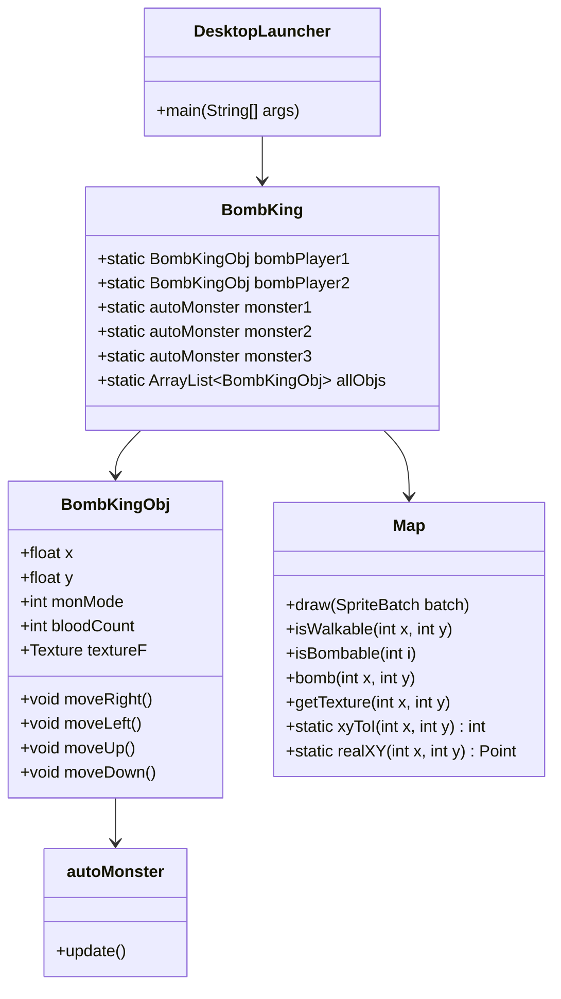
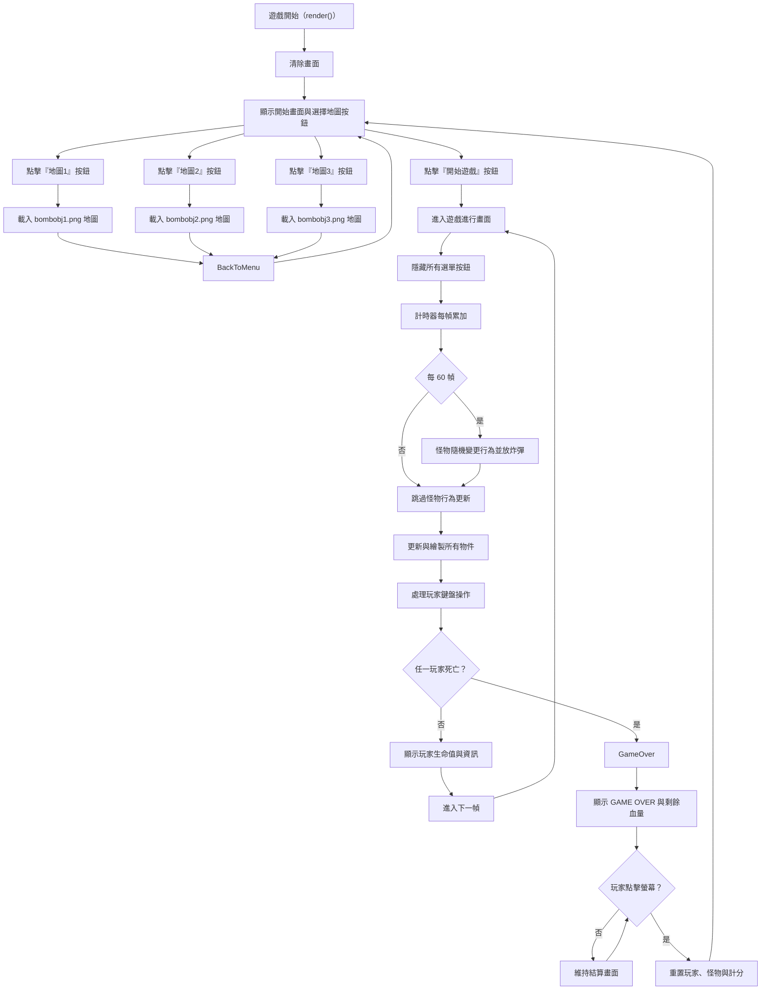
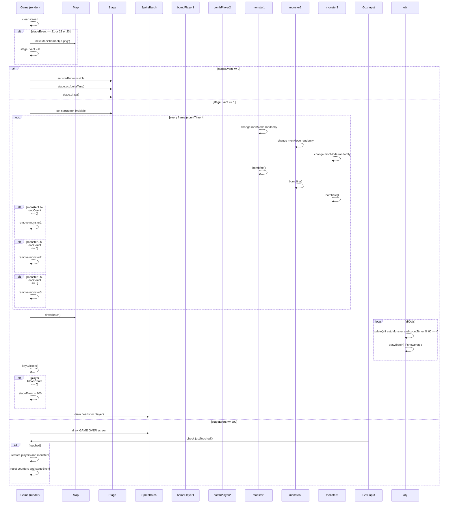

# 2025 JAVA 期末專案範例
- 學號：B11007104 姓名：王星凱、- 學號：B11207142 姓名：許育銘
- 分工說明：
- 王星凱:BombKing 基礎功能列表:1、2、5、6、8、10
- 許育銘:BombKing 基礎功能列表:3、4、7、9
- [報告影片連結](https://www.youtube.com/watch?v=zxrFlOgxfGo&t=10s)


## 遊戲說明
-目標: 玩家控制角色與對方對決，當玩家將對方血量歸零，遊戲便會結束。
 
-關卡進展: 
-防止敵人的攻擊。
-炸死對方。

-互動元素: 
-玩家通過鍵盤移動角色並可放置炸彈
-破壞障礙物，創造可行走的路。
-敵人會隨機攻擊，玩家需要躲避炸彈以免損失血量。

### 1. 遊戲流程
- 擊敗對方至血量歸零。

### 2. 操作方式
- 玩家移動：WASD、方向鍵。
- 放置炸彈攻擊：空格鍵、小鍵盤數字0。

## 指令及執行檔說明
### 下載完整repo後開啟Terminal執行以下指令
```
cd (exe資料夾存放路徑)
java -jar bombKing-1.0.0.jar
```

## 檔案結構
```

```

## 一、BombKing 基礎功能列表

此文件列出實作 BombKing 遊戲的 12 項基本功能模組，供遊戲開發規劃與專案分工參考。

---

### ✅ 1. 遊戲初始化與畫面佈局
- 建立遊戲主窗口（設定大小、標題、關閉操作）。
- 載入遊戲素材（玩家角色、敵人、炸彈、背景圖片、音效等資源）。
- 初始化遊戲狀態（生命值、關卡等）。

---

### ✅ 2. 玩家控制（移動、攻擊）
- 通過WASD、方向鍵移動控制玩家飛船位置。
- 按下空格鍵、小鍵盤數字0放置炸彈擊殺敵人。
---

### ✅ 3. 敵人生成與管理
- 生成敵人，固定位置刷新。
- 根據關卡難度調整敵人生成頻率與數量。
---

### ✅ 4. 敵人移動與行為
- 敵人隨機方向移動，設定在橘色外牆內。
- 每隔一段時間敵人放置炸彈。

---

### ✅ 5. 敵人攻擊
- 敵人放置炸彈攻擊玩家，炸彈爆炸會使玩家損失一顆心。

---

### ✅ 6.碰撞偵測（玩家、敵人攻擊）
- 玩家炸彈擊中敵人：敵人死亡，觸發爆炸效果。
- 玩家炸彈擊中障礙物：障礙物消失，形成道路。

---

### ✅ 7. 生命值與遊戲結束條件
- 玩家初始生命值為5顆心，敵人相同。
- 玩家生命值為 0 時進入 Game Over 畫面。

---

### ✅ 8.關卡系統
- 根據遊戲啟動介面選擇關卡（Level 1~3）。
- 根據關卡不同，顯示不同地圖。

---

### ✅ 9. 音效與背景音樂
- 包含爆炸音效、背景音樂。

---

### ✅ 10. 主選單與重新開始功能
- 顯示封面畫面，提供開始遊戲、關卡選項。
- Game Over 顯示相應畫面，支援重新開始或返回主選單。
## 二、UML 類別圖 (Class Diagram)


## 三、流程圖 (Flow Chart)


## 四、序列圖 (Sequence Diagram)



