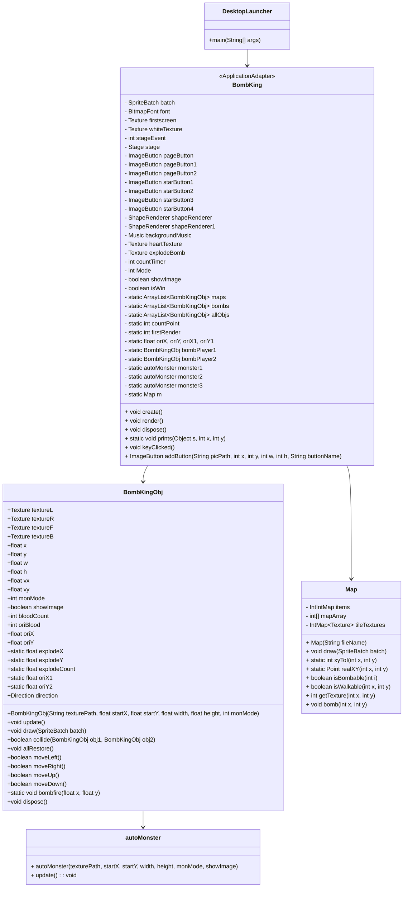
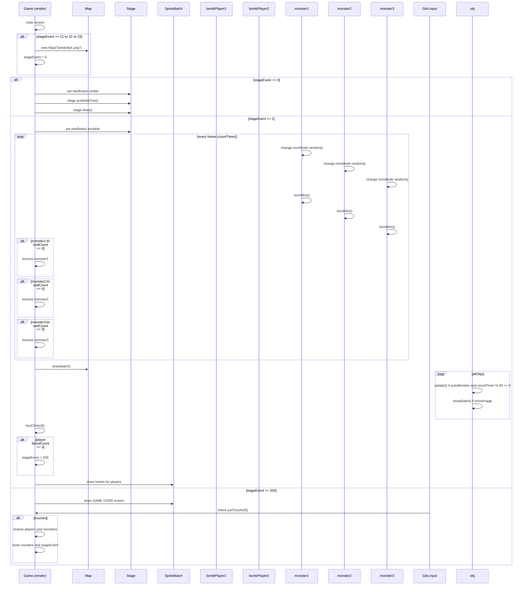

# 2025 JAVA 期末專案範例
- 學號：B11007104 姓å：ç‹æ˜Ÿå‡±ã€- 學號：B11207142 姓å：許育銘
- 分工說æ˜ï¼š
- ç‹æ˜Ÿå‡±:BombKing 基ç¤åŠŸèƒ½åˆ—表:1ã€2ã€5ã€6ã€8ã€10
- 許育銘:BombKing 基ç¤åŠŸèƒ½åˆ—表:3ã€4ã€7ã€9
- [報告影片連çµ](https://www.youtube.com/watch?v=y6POWcfspfI)
- [jar 檔](https://github.com/Wang11007104/javagame/tree/main/lwjgl3/build/libs)
- [javadoc文件](https://github.com/Wang11007104/javagame/tree/main/lwjgl3/build/docs/javadoc)
- [commit æ­·å²ç´€éŒ„](https://github.com/Wang11007104/javagame/blob/main/gitlog.txt)
- [報告簡報](https://www.canva.com/design/DAGoQ80296c/IGiCKB-IOV7M1KlmkizKNw/view?utm_content=DAGoQ80296c&utm_campaign=designshare&utm_medium=link2&utm_source=uniquelinks&utlId=he19eaaa1bc)


## éŠæˆ²èªªæ˜
-目標: ç©å®¶æ§åˆ¶è§’色與å°æ–¹å°æ±ºï¼Œç•¶ç©å®¶å°‡å°æ–¹è¡€é‡æ­¸é›¶ï¼ŒéŠæˆ²ä¾¿æœƒçµæŸã€‚
 
-é—œå¡é€²å±•: 
-防止敵人的攻擊。
-炸死å°æ–¹ã€‚

-互動元素: 
-ç©å®¶é€šééµç›¤ç§»å‹•è§’色並å¯æ”¾ç½®ç‚¸å½ˆ
-ç ´å£éšœç¤™ç‰©ï¼Œå‰µé€ å¯è¡Œèµ°çš„路。
-敵人會隨機攻擊，ç©å®¶éœ€è¦èº²é¿ç‚¸å½ˆä»¥å…æ失血é‡ã€‚

### 1. éŠæˆ²æµç¨‹
- æ“Šæ•—å°æ–¹è‡³è¡€é‡æ­¸é›¶ã€‚

### 2. æ“作方å¼
- ç©å®¶ç§»å‹•ï¼šWASDã€æ–¹å‘éµã€‚
- 放置炸彈攻擊：空格éµã€å°éµç›¤æ•¸å­—0。

## 指令åŠåŸ·è¡Œæª”說æ˜
### 下載完整repo後開啟Terminal執行以下指令
```
cd (exe資料夾存放路徑)
java -jar bombKing-1.0.0.jar
```

## 檔案çµæ§‹
```
javagame\lwjgl3/
 ┣ 📂build
 ┃ ┣ 📂libs
 ┃ ┃ ┗ 📜bombKing-1.0.0.jar
 ┣ 📂src
 ┃ ┗ 📂main
 ┃ ┃ ┣ 📂java
 ┃ ┃ ┃ ┗ 📂com
 ┃ ┃ ┃ ┃ ┗ 📂wxk
 ┃ ┃ ┃ ┃ ┃ ┗ 📂bombKing
 ┃ ┃ ┃ ┃ ┃ ┃ ┗ 📂lwjgl3
 ┃ ┃ ┃ ┃ ┃ ┃ ┃ ┣ 📜autoMonster.java
 ┃ ┃ ┃ ┃ ┃ ┃ ┃ ┣ 📜DesktopLauncher.java
 ┃ ┃ ┃ ┃ ┃ ┃ ┃ ┣ 📜BombKing.java
 ┃ ┃ ┃ ┃ ┃ ┃ ┃ ┗ 📜BombKingObj.java
 ┃ ┃ ┃ ┃ ┃ ┃ ┃ ┗ 📜Map.java
 ┃ ┣ 📂docs
 ┃ ┃ ┗ 📂javadoc
 ┃ ┃ ┃ ┣ 📂com
 ┃ ┃ ┃ ┃ ┗ 📂wxk
 ┃ ┃ ┃ ┃ ┃ ┗ 📂bombKing
 ┃ ┃ ┃ ┃ ┃ ┃ ┗ 📂lwjgl3
 ┃ ┃ ┃ ┃ ┃ ┃ ┃ ┣ 📜autoMonster.html
 ┃ ┃ ┃ ┃ ┃ ┃ ┃ ┣ 📜DesktopLauncher.html
 ┃ ┃ ┃ ┃ ┃ ┃ ┃ ┣ 📜BombKing.html
 ┃ ┃ ┃ ┃ ┃ ┃ ┃ ┣ 📜BombKingObj.html
 ┃ ┃ ┃ ┃ ┃ ┃ ┃ ┣ 📜package-tree.html
 ┃ ┃ ┃ ┃ ┃ ┃ ┃ ┗ 📜package-summary.html
 ┃ ┃ ┃ ┃ ┃ ┃ ┃ ┗ 📜Map.html

javagame\assets/
 ┣ 📜assets.txt
 ┣ 📜bgm.mp3
 ┣ 📜fire.mp3
 ┣ 📜bomb.png
 ┣ 📜bombB.png
 ┣ 📜bombF.png
 ┣ 📜bombL.png
 ┣ 📜bombR.png
 ┣ 📜bombobj1.ini
 ┣ 📜bombobj2.png
 ┣ 📜bombobj3.png
 ┣ 📜box.png
 ┣ 📜enemyB.mp3
 ┣ 📜enemyF.png
 ┣ 📜enemyL.png
 ┣ 📜enemyR.png
 ┣ 📜explode.png
 ┣ 📜fireR.png
 ┣ 📜health.png
 ┣ 📜house.png
 ┣ 📜road.png
 ┣ 📜tree.png
 ┣ 📜wall.png
 ┣ 📜map1.png
 ┣ 📜map2.png
 ┣ 📜map3.png
 ┣ 📜play.png
 ┣ 📜playerB.png
 ┣ 📜playerF.png
 ┣ 📜playerL.png
 ┣ 📜playerR.png
 ┣ 📜player2B.png
 ┣ 📜player2F.png
 ┣ 📜player2L.png
 ┣ 📜player2R.png
```

## 一ã€BombKing 基ç¤åŠŸèƒ½åˆ—表

此文件列出實作 BombKing éŠæˆ²çš„ 12 項基本功能模組，供éŠæˆ²é–‹ç™¼è¦åŠƒèˆ‡å°ˆæ¡ˆåˆ†å·¥åƒè€ƒã€‚

---

 ✅ 1. éŠæˆ²åˆå§‹åŒ–與畫é¢ä½ˆå±€
- 建立éŠæˆ²ä¸»çª—å£ï¼ˆè¨­å®šå¤§å°ã€æ¨™é¡Œã€é—œé–‰æ“作）。
- 載入éŠæˆ²ç´ æ（ç©å®¶è§’色ã€æ•µäººã€ç‚¸å½ˆã€èƒŒæ™¯åœ–片ã€éŸ³æ•ˆç­‰è³‡æºï¼‰ã€‚
- åˆå§‹åŒ–éŠæˆ²ç‹€æ…‹ï¼ˆç”Ÿå‘½å€¼ã€é—œå¡ç­‰ï¼‰ã€‚

---

 ✅ 2. ç©å®¶æ§åˆ¶ï¼ˆç§»å‹•ã€æ”»æ“Šï¼‰
- 通éWASDã€æ–¹å‘éµç§»å‹•æ§åˆ¶ç©å®¶é£›èˆ¹ä½ç½®ã€‚
- 按下空格éµã€å°éµç›¤æ•¸å­—0放置炸彈擊殺敵人。
---

 ✅ 3. 敵人生æˆèˆ‡ç®¡ç†
- 生æˆæ•µäººï¼Œå›ºå®šä½ç½®åˆ·æ–°ã€‚
- 根據關å¡é›£åº¦èª¿æ•´æ•µäººç”Ÿæˆé »ç‡èˆ‡æ•¸é‡ã€‚
---

 ✅ 4. 敵人移動與行為
- 敵人隨機方å‘移動，設定在橘色外牆內。
- æ¯éš”一段時間敵人放置炸彈。

---

 ✅ 5. 敵人攻擊
- 敵人放置炸彈攻擊ç©å®¶ï¼Œç‚¸å½ˆçˆ†ç‚¸æœƒä½¿ç©å®¶æ失一顆心。

---

 ✅ 6.碰æ’åµæ¸¬ï¼ˆç©å®¶ã€æ•µäººæ”»æ“Šï¼‰
- ç©å®¶ç‚¸å½ˆæ“Šä¸­æ•µäººï¼šæ•µäººæ­»äº¡ï¼Œè§¸ç™¼çˆ†ç‚¸æ•ˆæœã€‚
- ç©å®¶ç‚¸å½ˆæ“Šä¸­éšœç¤™ç‰©ï¼šéšœç¤™ç‰©æ¶ˆå¤±ï¼Œå½¢æˆé“路。

---

 ✅ 7. 生命值與éŠæˆ²çµæŸæ¢ä»¶
- ç©å®¶åˆå§‹ç”Ÿå‘½å€¼ç‚º5顆心，敵人相åŒã€‚
- ç©å®¶ç”Ÿå‘½å€¼ç‚º 0 時進入 Game Over ç•«é¢ã€‚

---

 ✅ 8.é—œå¡ç³»çµ±
- 根據éŠæˆ²å•Ÿå‹•ä»‹é¢é¸æ“‡é—œå¡ï¼ˆLevel 1~3）。
- 根據關å¡ä¸åŒï¼Œé¡¯ç¤ºä¸åŒåœ°åœ–。

---

 ✅ 9. 音效與背景音樂
- 包å«çˆ†ç‚¸éŸ³æ•ˆã€èƒŒæ™¯éŸ³æ¨‚。

---

 ✅ 10. 主é¸å–®èˆ‡é‡æ–°é–‹å§‹åŠŸèƒ½
- 顯示å°é¢ç•«é¢ï¼Œæ供開始éŠæˆ²ã€é—œå¡é¸é …。
- Game Over 顯示相應畫é¢ï¼Œæ”¯æ´é‡æ–°é–‹å§‹æˆ–è¿”å›ä¸»é¸å–®ã€‚
## 二ã€UML é¡åˆ¥åœ– (Class Diagram)


```mermaid
classDiagram
direction TB
    class DesktopLauncher {
	    +main(String[] args)
    }

    class BombKing {
    <<ApplicationAdapter>>
    - SpriteBatch batch
    - BitmapFont font
    - Texture firstscreen
    - Texture whiteTexture
    - int stageEvent
    - Stage stage
    - ImageButton pageButton
    - ImageButton pageButton1
    - ImageButton pageButton2
    - ImageButton starButton1
    - ImageButton starButton2
    - ImageButton starButton3
    - ImageButton starButton4
    - ShapeRenderer shapeRenderer
    - ShapeRenderer shapeRenderer1
    - Music backgroundMusic
    - Texture heartTexture
    - Texture explodeBomb
    - int countTimer
    - int Mode
    - boolean showImage
    - boolean isWin
    - static ArrayList~BombKingObj~ maps
    - static ArrayList~BombKingObj~ bombs
    - static ArrayList~BombKingObj~ allObjs
    - static int countPoint
    - static int firstRender
    - static float oriX, oriY, oriX1, oriY1
    - static BombKingObj bombPlayer1
    - static BombKingObj bombPlayer2
    - static autoMonster monster1
    - static autoMonster monster2
    - static autoMonster monster3
    - static Map m
    + void create()
    + void render()
    + void dispose()
    + static void prints(Object s, int x, int y)
    + void keyClicked()
    + ImageButton addButton(String picPath, int x, int y, int w, int h, String buttonName)
}

   class BombKingObj {
        +Texture textureL
        +Texture textureR
        +Texture textureF
        +Texture textureB
        +float x
        +float y
        +float w
        +float h
        +float vx
        +float vy
        +int monMode
        +boolean showImage
        +int bloodCount
        +int oriBlood
        +float oriX
        +float oriY
        +static float explodeX
        +static float explodeY
        +static float explodeCount
        +static float oriX1
        +static float oriY2
        +Direction direction
        +BombKingObj(String texturePath, float startX, float startY, float width, float height, int monMode)
        +void update()
        +void draw(SpriteBatch batch)
        +boolean collide(BombKingObj obj1, BombKingObj obj2)
        +void allRestore()
        +boolean moveLeft()
        +boolean moveRight()
        +boolean moveUp()
        +boolean moveDown()
        +static void bombfire(float x, float y)
        +void dispose()
    }

    class autoMonster {
        + autoMonster(texturePath, startX, startY, width, height, monMode, showImage)
        + update() : void
    }

    class Map {
        - IntIntMap items
        - int[] mapArray
        - IntMap~Texture~ tileTextures
        + Map(String fileName)
        + void draw(SpriteBatch batch)
        + static int xyToI(int x, int y)
        + static Point realXY(int x, int y)
        + boolean isBombable(int i)
        + boolean isWalkable(int x, int y)
        + int getTexture(int x, int y)
        + void bomb(int x, int y)
    }

    DesktopLauncher-->BombKing
    BombKing --> BombKingObj
    BombKingObj --> autoMonster
    BombKing --> Map
```
## 三ã€æµç¨‹åœ– (Flow Chart)

```mermaid
flowchart TD
    Start["éŠæˆ²é–‹å§‹ï¼ˆrender()）"] --> ClearScreen["清除畫é¢"]

    ClearScreen --> ShowMenu["顯示開始畫é¢èˆ‡é¸æ“‡åœ°åœ–按鈕"]

    ShowMenu --> ClickPlay["é»æ“Šã€é–‹å§‹éŠæˆ²ã€æŒ‰éˆ•"]
    ShowMenu --> ClickMap1["é»æ“Šã€åœ°åœ–1ã€æŒ‰éˆ•"]
    ShowMenu --> ClickMap2["é»æ“Šã€åœ°åœ–2ã€æŒ‰éˆ•"]
    ShowMenu --> ClickMap3["é»æ“Šã€åœ°åœ–3ã€æŒ‰éˆ•"]

    ClickMap1 --> LoadMap1["載入 bombobj1.png 地圖"]
    ClickMap2 --> LoadMap2["載入 bombobj2.png 地圖"]
    ClickMap3 --> LoadMap3["載入 bombobj3.png 地圖"]

    LoadMap1 --> BackToMenu
    LoadMap2 --> BackToMenu
    LoadMap3 --> BackToMenu
    BackToMenu --> ShowMenu

    ClickPlay --> GameStart["進入éŠæˆ²é€²è¡Œç•«é¢"]

    GameStart --> HideButtons["éš±è—所有é¸å–®æŒ‰éˆ•"]
    HideButtons --> UpdateTimer["計時器æ¯å¹€ç´¯åŠ "]

    UpdateTimer --> Check60Frames{"æ¯ 60 å¹€"}
    Check60Frames -- 是 --> MonsterAction["怪物隨機變更行為並放炸彈"]
    Check60Frames -- å¦ --> è·³é怪物行為更新

    MonsterAction --> è·³é怪物行為更新
    è·³é怪物行為更新 --> UpdateAllObjs["更新與繪製所有物件"]
    UpdateAllObjs --> HandleInput["處ç†ç©å®¶éµç›¤æ“作"]

    HandleInput --> CheckPlayerDead{"任一ç©å®¶æ­»äº¡ï¼Ÿ"}
    CheckPlayerDead -- 是 --> GameOver
    CheckPlayerDead -- å¦ --> ShowUI["顯示ç©å®¶ç”Ÿå‘½å€¼èˆ‡è³‡è¨Š"]
    ShowUI --> NextFrame["進入下一幀"]
    NextFrame --> GameStart

    GameOver --> ShowResult["顯示 GAME OVER 與剩餘血é‡"]
    ShowResult --> WaitForTouch{"ç©å®¶é»æ“Šè¢å¹•ï¼Ÿ"}

    WaitForTouch -- 是 --> ResetGame["é‡ç½®ç©å®¶ã€æ€ªç‰©èˆ‡è¨ˆåˆ†"]
    ResetGame --> ShowMenu

    WaitForTouch -- å¦ --> StayGameOver["維æŒçµç®—ç•«é¢"]
    StayGameOver --> WaitForTouch


```
## å››ã€åºåˆ—圖 (Sequence Diagram)


```mermaid
sequenceDiagram
    participant Game as Game (render)
    participant Map as Map
    participant Stage as Stage
    participant Batch as SpriteBatch
    participant Player1 as bombPlayer1
    participant Player2 as bombPlayer2
    participant Monster1 as monster1
    participant Monster2 as monster2
    participant Monster3 as monster3
    participant Input as Gdx.input

    Game->>Game: clear screen
    alt stageEvent == 21 or 22 or 23
        Game->>Map: new Map("bombobjX.png")
        Game->>Game: stageEvent = 0
    end

    alt stageEvent == 0
        Game->>Stage: set starButton visible
        Game->>Stage: stage.act(deltaTime)
        Game->>Stage: stage.draw()
    else stageEvent == 1
        Game->>Stage: set starButton invisible
        loop every frame (countTimer)
            Monster1->>Monster1: change monMode randomly
            Monster2->>Monster2: change monMode randomly
            Monster3->>Monster3: change monMode randomly

            Monster1->>Monster1: bombfire()
            Monster2->>Monster2: bombfire()
            Monster3->>Monster3: bombfire()

            alt monster1.bloodCount <= 0
                Game->>Game: remove monster1
            end
            alt monster2.bloodCount <= 0
                Game->>Game: remove monster2
            end
            alt monster3.bloodCount <= 0
                Game->>Game: remove monster3
            end
        end
        Game->>Map: draw(batch)
        loop allObjs
            obj->>obj: update() if autoMonster and countTimer % 60 == 0
            obj->>obj: draw(batch) if showImage
        end
        Game->>Game: keyClicked()
        alt player bloodCount <= 0
            Game->>Game: stageEvent = 200
        end
        Game->>Batch: draw hearts for players
    else stageEvent == 200
        Game->>Batch: draw GAME OVER screen
        Input->>Game: check justTouched()
        alt touched
            Game->>Game: restore players and monsters
            Game->>Game: reset counters and stageEvent
        end
    end


```
## 五ã€èˆ‡AI互動關係
-1.chatGPT
-Swing與lib GDX 的Timer使用差別
-如何使gradle(主è¦ä½¿ç”¨åˆ°çš„功能:編譯程å¼è¶Šévscode內建編譯ã€ç”¢ç”Ÿjavadocã€ç”¢å‡ºjar檔)
-java套件安è£Javadoc Comment Generator
-下載git套件並產出gitlog
-æµç¨‹åœ–判斷å¼å®Œæ•´æ€§
-產出人物圖片
-2.samsung繪圖智慧助ç†
-產出部分按鈕與開始圖片等等
-3.suno AI
-產出背景音樂
